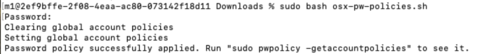

This script is based on https://gist.github.com/Freccia/37df869bd91a2c5edfffd4b02f5d24f0 but is actually working because the constants are never not used !!

It has been tested on macOS version 14 and 15.

1. Modify the values of constants in the file.
2. Execute the script with `bash osx-pwpolicy.sh`
3. Check by creating a new user

Result of the script :

