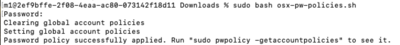

This script is based on https://gist.github.com/Freccia/37df869bd91a2c5edfffd4b02f5d24f0 but is actually working because the constants were never used !!

By default, these are the values :
PW_EXPIRE=360                   # 180 days password expiration
MIN_LENGTH=12                   # at least 12 chars for password
MIN_ALPHA_LOWER=1               # at least 1 lower case letter in password
MIN_UPPER_ALPHA=1               # at least 1 upper case letter in password
MIN_SPECIAL_CHAR=1              # at least one special character in password
PW_HISTORY=3                    # remember last 3 passwords

It has been tested on macOS version 14 and 15.

1. Modify the values of constants in the file.
2. Execute the script in a command line with `sudo bash osx-pwpolicy.sh`
3. Check by creating a new user

Result of the script :

